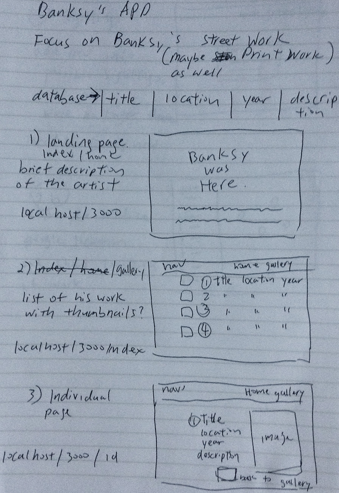
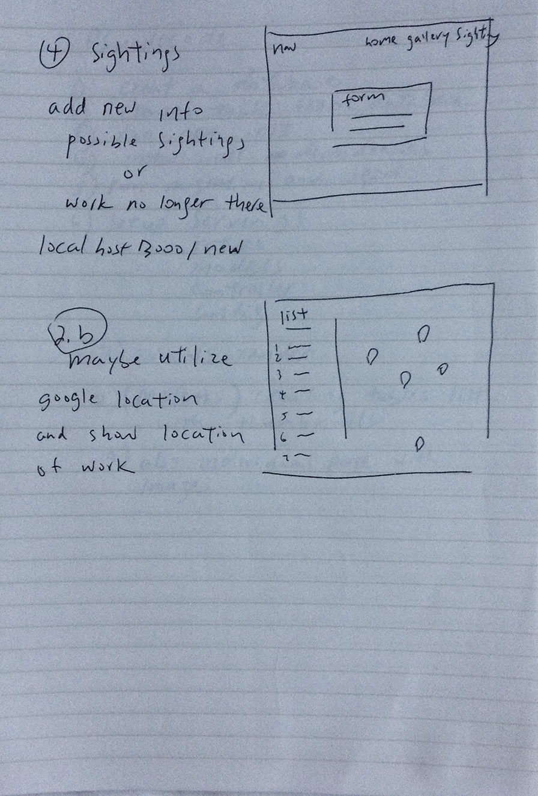

# project-2-express

## Original Whiteboard

## project in two Phases

###Concept

- A site on the artist, Banksy. 
- Database will be his 31 days of work in nyc.
- Database will be consist of title, location date, description and photo

##website
-landing page
-index, list the database
-single, list thae data by day
-add, allows to add to the database
-edit, add comments

###Project is diveded into two phases.
- Phase 1 CRUD APPLICAION with create, edit, and delete functionality.
- Implement Google location/Marker API

###Technologies Used

- HTML / EJS
- Node and Express
- MVC Pattern
- SQL / PG-PROMISE
- CSS & Design

###Unsolved problems
- API (post-MVP): Didn't get to implement public api

